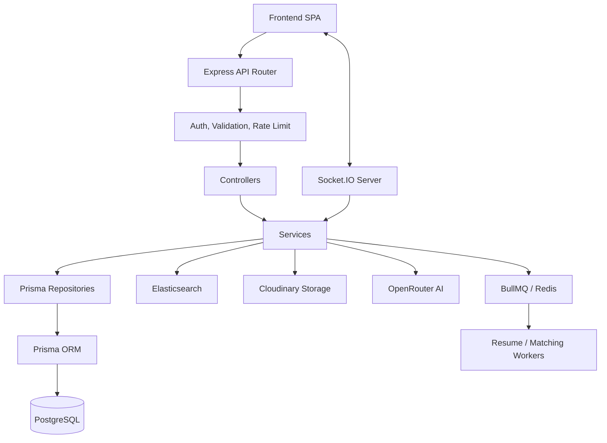

# TalentForge AI — Backend

The TalentForge AI backend is a robust, modular Node.js/Express application that powers the recruitment platform. It manages the server-side business logic, APIs, secure authentication, role-based authorization, recruitment workflows, real-time interviews, live coding assessments, background job processing, AI integration (via OpenRouter), and data persistence using PostgreSQL and Elasticsearch.

## Table of Contents

- [Overview](#overview)
- [Key Features](#key-features)
- [User Roles](#user-roles)
- [Recruitment Workflow](#recruitment-workflow)
- [System Architecture](#system-architecture)
- [Backend Architecture](#backend-architecture)
- [Request Lifecycle](#request-lifecycle)
- [Core Modules](#core-modules)
- [Authentication & Authorization](#authentication--authorization)
- [API Documentation](#api-documentation)
- [API Response & Error Format](#api-response--error-format)
- [Database](#database)
- [Redis](#redis)
- [Background Jobs & BullMQ](#background-jobs--bullmq)
- [Real-Time Communication](#real-time-communication)
- [Assessments](#assessments)
- [Interviews](#interviews)
- [AI Integration](#ai-integration)
- [Resume & File Processing](#resume--file-processing)
- [Email & Notifications](#email--notifications)
- [Validation](#validation)
- [Error Handling](#error-handling)
- [Logging](#logging)
- [Security](#security)
- [Environment Variables](#environment-variables)
- [Project Structure](#project-structure)
- [Local Development Setup](#local-development-setup)
- [Database Setup](#database-setup)
- [Running the Backend](#running-the-backend)
- [API Documentation / Swagger](#api-documentation--swagger)
- [Testing](#testing)
- [Docker](#docker)
- [Performance & Scalability](#performance--scalability)
- [Security Considerations](#security-considerations)
- [Known Limitations](#known-limitations)
- [Future Improvements](#future-improvements)
- [Troubleshooting](#troubleshooting)
- [Contributing](#contributing)

---

## Overview

TalentForge AI Backend provides the foundational data layer and business logic for the TalentForge AI recruitment platform. It serves the frontend SPA, handles data storage (Postgres/Prisma), manages search (Elasticsearch), executes background tasks (BullMQ/Redis), and communicates in real-time with clients (Socket.IO). 

---

## Key Features

- **Authentication**: JWT-based auth with access and refresh tokens, role-based access control (RBAC).
- **Recruitment Management**: Job postings, application tracking, custom hiring workflows.
- **Assessments**: Support for multiple question types (MCQ, DSA, Project), candidate assignment, and evaluation.
- **Interviews**: Live WebRTC signaling and AI-automated interviews.
- **Search & Matching**: Elasticsearch-powered job and candidate matching.
- **Real-Time**: Socket.IO for interview rooms and live resume parsing updates.
- **Background Processing**: BullMQ for async tasks (resume parsing, matching).
- **File Processing**: PDF/Docx parsing and Cloudinary storage.
- **Security**: Rate limiting, Helmet, CORS, and structured logging.

---

## User Roles

| Role | Responsibilities |
|------|------------------|
| **CANDIDATE** | Manage profile, upload resumes, browse/apply to jobs, take assessments, attend interviews. |
| **EMPLOYER** | Manage company profile, post jobs, configure custom hiring workflows, review candidates, conduct interviews. |
| **ADMIN** | Platform administration and oversight. |
| **SUPER_ADMIN** | High-level system administration and configuration. |

*(Employers also have sub-roles at the company level: OWNER, ADMIN, RECRUITER, HIRING_MANAGER).*

---

## Recruitment Workflow

1. **Job Posting**: Employer creates a job and assigns a custom Hiring Workflow.
2. **Application**: Candidate applies (Resume uploaded & parsed in background).
3. **Screening (Matching)**: Elasticsearch asynchronously matches candidates to jobs.
4. **Assessment**: Candidate assigned and attempts an assessment (MCQ/DSA).
5. **Interview**: Candidate scheduled for a live or AI interview.
6. **Hiring Decision**: Candidate moved to HIRED or REJECTED in the workflow.

---

## System Architecture



---

## Backend Architecture

The backend follows a domain-driven, layered modular architecture:

- **Routes**: Define HTTP endpoints and map them to controllers.
- **Middleware**: Intercept requests for logging (`morgan`/`pino`), validation (`zod`), auth, and rate-limiting.
- **Controllers**: Handle HTTP request/response formatting.
- **Services**: Contain core business logic.
- **Repositories**: Abstract database queries using Prisma.

---

## Request Lifecycle

```text
HTTP Request
     ↓
CORS & Helmet Middleware
     ↓
Rate Limiter (express-rate-limit)
     ↓
Request Logger (pino-http/morgan)
     ↓
Authentication Middleware (if protected)
     ↓
Route Handler
     ↓
Validation (Zod schemas)
     ↓
Controller
     ↓
Service (Business Logic)
     ↓
Repository (Prisma)
     ↓
HTTP Response
```

---

## Core Modules

- **Auth**: Registration, login, JWT token generation, and password resets.
- **Company**: Company profiles, employer onboarding, and Elasticsearch indexing.
- **Jobs**: Job postings, visibility, requirements.
- **Candidate & Applications**: Candidate profiles, job applications, application workflows.
- **Hiring Workflow**: Custom stage libraries, pipelines, and application state transitions.
- **Assessment**: Question banks, assessment builders, assignments, execution (attempts), and evaluations.
- **Interviews**: Live rooms, AI interview flow, WebRTC signaling.
- **Resume**: Multer/Cloudinary uploads, text extraction (pdf-parse/mammoth), background parsing queue.
- **Matching**: Elasticsearch-based candidate-to-job recommendation logic.

---

## Authentication & Authorization

- **JWT Flow**: Uses short-lived Access Tokens (in-memory on frontend) and longer-lived Refresh Tokens (stored in DB and sent as HttpOnly cookies).
- **Passwords**: Hashed using `bcrypt`.
- **Middleware**: `authenticateUser` verifies the JWT. `authorizeRoles` checks the `UserRole` enum.

---

## API Documentation

Base Path: `/api/v1`

*Example Endpoints (See Swagger/Postman for full list):*

| Method | Endpoint | Role | Description |
|--------|----------|------|-------------|
| POST | `/auth/register` | Public | Register new user |
| POST | `/auth/login` | Public | Authenticate user |
| POST | `/auth/new-refresh-token` | Refresh Token | Issue new access token |
| GET | `/companies/:id` | Public | Get company details |
| POST | `/jobs` | EMPLOYER | Create a job posting |
| GET | `/candidate/applications` | CANDIDATE | List candidate applications |

---

## API Response & Error Format

**Success Response:**
```json
{
  "success": true,
  "message": "Operation successful",
  "data": { ... }
}
```

**Error Response:**
```json
{
  "success": false,
  "error": "Error code (e.g., VALIDATION_ERROR)",
  "message": "Human readable message"
}
```

---

## Database

- **Provider**: PostgreSQL via Prisma ORM.
- **Key Entities**: `User`, `Candidate`, `Employer`, `Company`, `Job`, `Application`, `Workflow`, `Assessment`, `Interview`.

---

## Redis

Used for:
- **BullMQ**: Backing store for message queues (resume parsing, matching).
- **Socket.IO**: Used for pub/sub if scaling across multiple nodes (configured via env).

---

## Background Jobs & BullMQ

- **Resume Queue**: Handles asynchronous PDF/DOCX text extraction and AI parsing so the HTTP request doesn't block.
- **Matching Queue**: Computes candidate-job compatibility scores and syncs data to Elasticsearch.

---

## Real-Time Communication

- **Library**: `socket.io`
- **Use Cases**:
  - **Interviews**: WebRTC signaling, chat, live coding synchronization.
  - **Resume Parsing**: Emits events to the client when background parsing is complete.

---

## Assessments

The assessment engine handles multiple question types (MCQ, DSA, Project).
- **Builder**: Employers create assessments from the Question Library.
- **Execution**: Candidate attempts are tracked via `AssessmentAttempt`.
- **Evaluation**: Scores are calculated upon submission.

---

## Interviews

- **Live Interviews**: Recruiter and Candidate join a Socket.IO room.
- **AI Interviews**: Configured via OpenRouter. The backend generates questions, evaluates answers, and drives the interview state.
- **Timeout Worker**: A background scheduler expires stale interview sessions.

---

## AI Integration

- **Provider**: OpenRouter (configured via `OPENROUTER_API_KEY`).
- **Functionality**:
  - Resume Parsing (extracting structured JSON from raw text).
  - AI Interviews (generating context-aware questions and evaluations).
- **Security**: The backend proxies all requests. Keys are NEVER sent to the client.

---

## Resume & File Processing

1. Client uploads file (Multer).
2. File streams to Cloudinary (`multer-storage-cloudinary`).
3. Webhook/Response triggers a BullMQ Job.
4. Worker downloads file, extracts text (`pdf-parse`/`mammoth`).
5. AI parses text into structured JSON.
6. Socket.IO notifies client of completion.

---

## Email & Notifications

- **Providers**: Resend and AgentMail.
- **Use Cases**: Email verification, password reset, interview invitations.

---

## Validation

- **Library**: `zod`.
- Request bodies, query parameters, and env variables are validated before controller execution.

---

## Error Handling

- **Middleware**: `error.middleware.ts` catches unhandled exceptions, logs them, and formats a consistent JSON response.
- **Custom Errors**: Standard HTTP status codes are used (400, 401, 403, 404, 500).

---

## Logging

- **Libraries**: `pino`, `pino-http`, `morgan`.
- **Configuration**: Structured JSON logging in production, pretty-printing in development.

---

## Security

- **Helmet**: Secures HTTP headers.
- **CORS**: Configured strictly for the frontend origin.
- **Rate Limiting**: Protects against brute-force (express-rate-limit).
- **Tokens**: HttpOnly cookies prevent XSS theft of refresh tokens.

---

## Environment Variables

| Variable | Required | Purpose | Sensitive |
|----------|----------|---------|-----------|
| `PORT` | Yes | HTTP Port | No |
| `DATABASE_URL` | Yes | Postgres connection string | Yes |
| `JWT_ACCESS_SECRET` | Yes | Sign access tokens | Yes |
| `ELASTICSEARCH_URL` | Yes | Search engine URL | No |
| `OPENROUTER_API_KEY`| Yes | AI provider key | Yes |
| `REDIS_URL` | Yes | BullMQ backing store | Yes |
| `CLOUDINARY_API_KEY`| Yes | File storage | Yes |

*(Do not commit `.env` files. Use `.env.example` as a template).*

---

## Project Structure

```text
Backend/
├── prisma/                 # Database schema, migrations, and seeds
├── src/
│   ├── common/             # Middleware, logger, utilities
│   ├── config/             # Environment validation, DB connect
│   ├── modules/            # Domain modules (auth, jobs, candidate, etc.)
│   │   ├── [module]/
│   │   │   ├── controllers/
│   │   │   ├── services/
│   │   │   ├── routes/
│   │   │   └── websocket/  # If applicable
│   ├── routes/             # Main API router index
│   ├── app.ts              # Express app setup
│   └── server.ts           # HTTP server and Socket.IO entry point
├── Dockerfile              # Docker build instructions
├── docker-compose.yml      # Local dev services (Postgres, Redis, Elastic)
└── package.json
```

---

## Local Development Setup

1. **Clone and Install**:
   ```bash
   npm install
   ```
2. **Environment Variables**:
   Copy `.env.example` to `src/config/.env` and fill in the values.
3. **Start Infrastructure** (Postgres, Redis, Elasticsearch):
   ```bash
   docker-compose up -d
   ```
4. **Database Setup**:
   ```bash
   npx prisma generate
   npx prisma migrate dev
   npm run seed
   ```
5. **Start Server**:
   ```bash
   npm run dev
   ```

---

## Running the Backend

- **Development**: `npm run dev` (Uses `tsx` for hot-reloading).
- **Production**: 
  ```bash
  npm run build
  npm start
  ```

---

## API Documentation / Swagger

Swagger/OpenAPI is configured via `swagger-jsdoc` and `swagger-ui-express`.
(Verify path in source, typically exposed at `/api-docs`).

---

## Testing

- **Framework**: Jest (`ts-jest`).
- **Run Tests**:
  ```bash
  npm run test
  ```

---

## Docker

- `Dockerfile`: Multi-stage build for production.
- `docker-compose.yml`: Local infrastructure (DB, Redis, Elasticsearch).
- `docker-compose.prod.yml`: Production deployment overrides.

---

## Performance & Scalability

- **Async Queues**: BullMQ offloads heavy parsing and matching tasks.
- **Search Engine**: Elasticsearch provides fast, scalable full-text search over Postgres.
- **Connection Pooling**: Prisma handles Postgres connection pooling.

---

## Security Considerations

- **DO NOT** commit `.env` files.
- The Cloudinary API Key, OpenRouter API Key, and JWT Secrets must remain secure.
- Ensure the Frontend URL in CORS perfectly matches the production client to prevent cross-origin attacks.

---

## Known Limitations

- Real-time features require a persistent WebSocket connection; load balancing requires a Redis adapter for Socket.IO.
- External dependencies (Cloudinary, OpenRouter) can rate-limit or fail, requiring robust retry logic in Queues.

---

## Future Improvements

- Fully implement unit and E2E test coverage across all modules.
- Introduce Redis caching for read-heavy API endpoints (e.g., public jobs).
- Implement WebRTC TURN/STUN servers natively for more robust live video interviews.

---

## Troubleshooting

- **Database Connection Failed**: Check if `docker-compose up` is running and `DATABASE_URL` is correct.
- **Queue Jobs Stalling**: Ensure Redis is running and reachable.
- **CORS Errors**: Verify `FRONTEND_URL` in `.env` matches the client making the request.

---

## Contributing

1. Create a feature branch.
2. Run `npm run lint` and `npm run typecheck`.
3. Submit a Pull Request.
